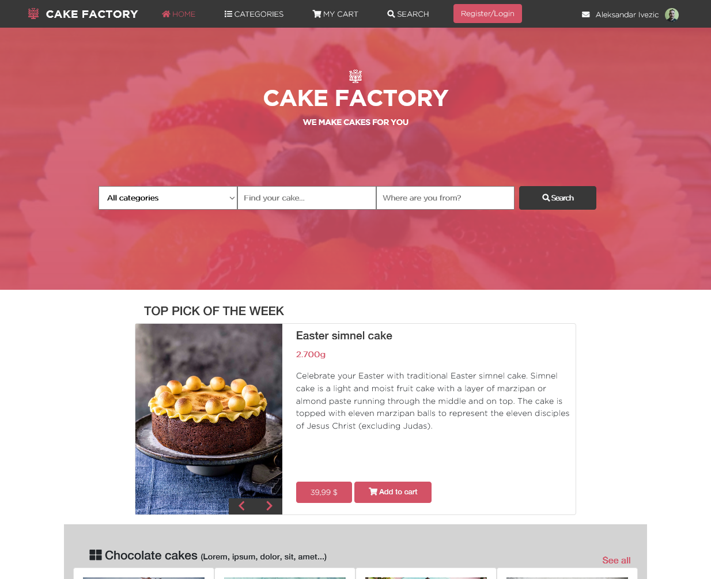

# Capstone project: Cake-Factory

> The goal of this project is to build an online web store for selling cakes that will have home and search page available on mobile and big screen

The Capstone instructions require that our website has at least two pages:
  1. Main page with the link to the search results page
  2. Search results page
  
And it should be responsive in two screen sizes:
  1. Mobile: up to 768px 
  2. Tablet & Desktop: from 768px
## Built With

- HTML5
- CSS3
- BOOTSTRAP5

## Live Demo

[Live Demo Link](https://aleksandarIvezic.github.io/Cake-Factory/)

## Getting Started

No prerequisites

To get  a local copy:
 
- Cloning repository:
 1. Press the green button "Code" and copy the link bellow
 2. Then open terminal or Git Bash in a folder where you want to copy the repository
 3. Type command "git clone" and paste the address that you copied
 4. Press "Enter"
 5. Find the "index.html" file and double click on it
- Download zip file:
 1. Press the green button "Code" and press "Download ZIP"
 2. Save the file and extract it in any folder you wish
 3. Find the "index.html" file in extracted file and double click on it
  
To run it online just click on [Live Demo Link](https://shinobiwarior.github.io/Cake-Factory/)

## Author

👤 **Aleksandar Ivezic**

- GitHub: [Aleksandar Ivezic](https://github.com/ShinobiWarior)
- Twitter: [@Aivezic](https://twitter.com/Aivezic)
- LinkedIn: [Aleksandar Ivezic](https://www.linkedin.com/in/aleksandar-ivezi%C4%87-1a6b0391/)

## 🤝 Contributing

Contributions, issues, and feature requests are welcome!

Feel free to check the [issues page](https://github.com/ShinobiWarior/Cake-Factory/issues/).

## Show your support

Give ⭐️ if you like this project!

## Acknowledgments
- This project was inspired by [Microverse](https://www.microverse.org/?grsf=w9rx3c)
